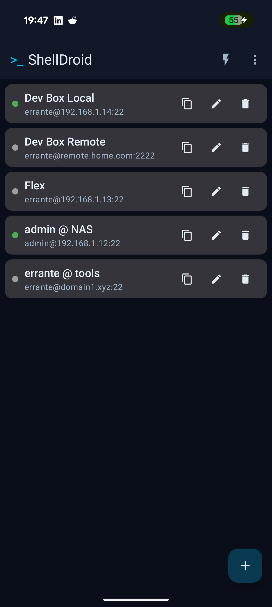
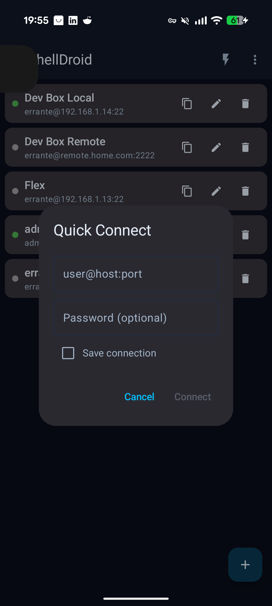
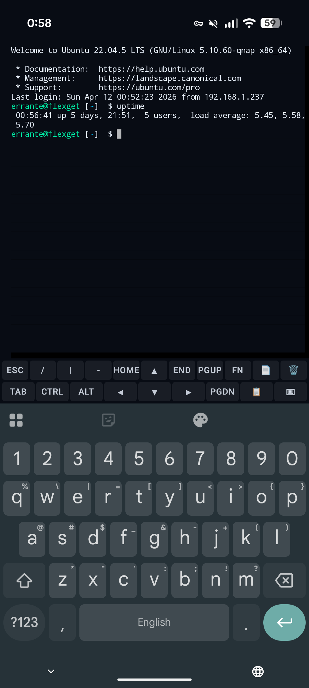
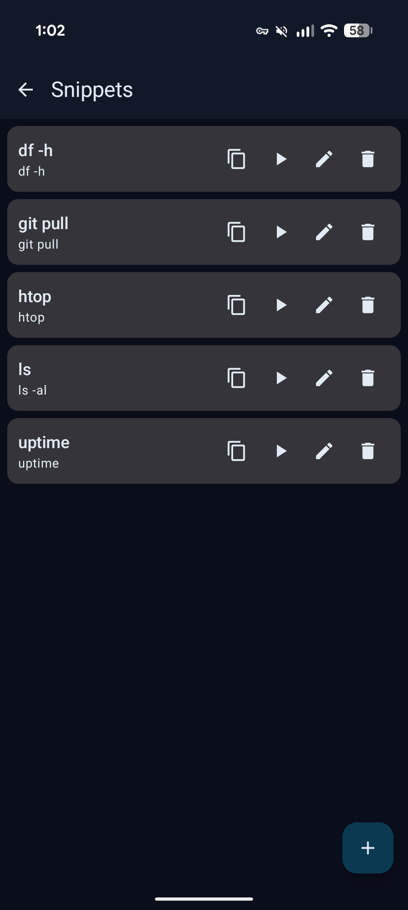
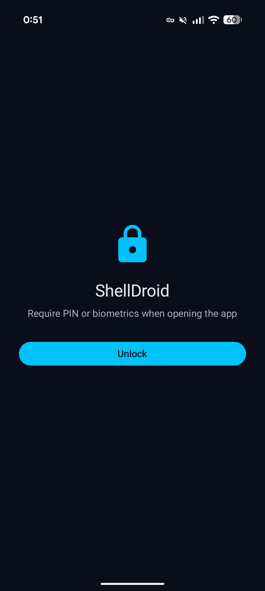

# ShellDroid

<p align="center">
  
</p>

<p align="center">
  <strong>A professional SSH client for Android. No ads. No tracking. Open source.</strong>
</p>

<p align="center">
  <a href="https://shelldroid.ebadenes.com/">Website</a> ·
  <a href="https://groups.google.com/g/shelldroid-testers">Join the beta</a> ·
  <a href="#build">Build</a> ·
  <a href="#license">License</a>
</p>

---

## Beta — testers welcome

ShellDroid is in **closed beta** on Google Play. To get access:

1. **[Join the testers group](https://groups.google.com/g/shelldroid-testers)** (one click)
2. **[Download from Google Play](https://play.google.com/apps/testing/com.ebadenes.shelldroid)**

---

## Why

JuiceSSH Pro disappeared. Years of muscle memory — the hacker keyboard, the two-row bar, quick connect, snippets — gone. The alternatives are either abandonware (ConnectBot, last meaningful commit 2019) or Termius at $10/month for features I use 20% of the time.

So I built ShellDroid.

Most Android SSH clients use JSch or sshlib — pure Java, aging crypto, slow key exchange. ShellDroid uses **native libssh via JNI**, compiled with mbedTLS and 16KB page alignment. The cryptographic layer is current, Ed25519 and ECDSA work correctly, and the key exchange is noticeably faster on the first connection.

The terminal is built on **org.connectbot:termlib** as a real `@Composable` — not an AndroidView wrapped in Compose glue. Focus, IME resizing, and key handling are native to the composition tree. No hacks, no flickering.

## Screenshots

<p align="center">
  
  
  
  
  
</p>

## Features

### Connection
- **Native SSH** — libssh 0.11.4 via JNI. Auth by password and public key (RSA, Ed25519, ECDSA)
- **Quick Connect** — `user@host:port`, optional password, optional save. Ephemeral connections are deleted on disconnect
- **Live host status** — green dot when the SSH session is active, grey when idle
- **TOFU** — Trust On First Use with per-host known hosts manager (view/delete individual keys)
- **Credentials picker** — choose between a one-time password or a saved identity in the same modal

### Terminal
- **Compose-native** — termlib from ConnectBot, no `AndroidView`. IME, selection, and hyperlinks integrated
- **Hacker keyboard** — 2-row bar (JuiceSSH style) with ESC, arrows, CTRL/ALT sticky, F1–F12, haptic feedback
- **Snippets** — saved commands you can run on any active session with one tap
- **Auto-command** — command that runs automatically after connecting to a host
- **Keep screen on** — optional `FLAG_KEEP_SCREEN_ON` while a terminal is open
- **Volume zoom** — change font size with volume keys (persisted)
- **Smart back gesture** — Android 14+ predictive back with keep/disconnect dialog

### Port forwarding
- **LOCAL** — `ssh -L` via libssh `direct-tcpip`. `ServerSocket` → bidirectional pipe over SSH channel
- **DYNAMIC** — SOCKS5 proxy over SSH (`ssh -D`). RFC 1928 handshake in Kotlin, reuses direct-tcpip channel
- **Auto-connect** — tapping Play on a forward connects the SSH host first if not already live
- **REMOTE** — `ssh -R` coming soon

### Security
- **Credential vault** — Tink AES-256-GCM over DataStore. `CharArray` + zeroize, never in the JVM string pool
- **App lock** — delegates to the system (BiometricPrompt + `DEVICE_CREDENTIAL`). Fingerprint, system PIN, or pattern. No in-app PIN to forget
- **Auto-lock timeout** — configurable: "Same as system" (reads `Settings.System.SCREEN_OFF_TIMEOUT`), Immediate, 1/5/15 min, Never
- **No insecure backups** — `android:allowBackup=false`, restrictive data extraction rules

### UI / UX
- **Skins** — Abyss (default) and Solarized Dark with 16-color ANSI palette. Live switching
- **Dark / Light** — follows system or forced. Full Abyss palette
- **i18n** — English and Spanish, configurable from Settings
- **Splash screen** — clean boot transition with the Abyss logo
- **Foreground service** — sessions survive in background with i18n notification, timer, and hostname. "Open terminal" / "Disconnect" actions from the notification
- **Clone** — duplicate hosts, identities, snippets, or port forwards with one tap

## Stack

| Layer | Technology |
|-------|-----------|
| Language | Kotlin 2.3.20 |
| UI | Jetpack Compose + Material 3 (BOM 2026.03.01) |
| Terminal | [ConnectBot termlib](https://connectbot.org) 0.0.24 |
| SSH | [libssh](https://www.libssh.org) 0.11.4 native (JNI) + mbedTLS 3.6.4 |
| DI | Hilt 2.59.2 |
| DB | Room 2.8.4 |
| Crypto | Tink 1.15.0 |
| Build | AGP 9.1.0, Gradle 9.4.1, KSP 2.3.6 |
| Min SDK | 26 (Android 8.0+) |

## Modules

```
:app                    → Activity, NavHost, Settings
:core:ssh               → LibSshClient, SshSessionManager, ShellChannel
:core:ssh-native        → JNI bindings (libssh + mbedTLS .so)
:core:db                → Room entities, DAOs, migrations
:core:security          → CredentialVault (Tink), LockManager
:core:ui                → Theme, strings i18n, shared UI
:feature:hosts          → CRUD hosts + Quick Connect
:feature:identities     → CRUD identities (password, keys)
:feature:terminal       → TerminalBridge, TerminalScreen, KeyBar, skins
:feature:snippets       → CRUD snippets
:feature:portforward    → CRUD port forwards
:service:session        → Foreground service + notification
```

## Build

The entire build runs in Docker (no Android SDK required on the host):

```bash
./vendor/setup.sh                        # first time: clones libssh, mbedtls
./docker-gradle.sh :app:assembleDebug    # APK in app/build/outputs/apk/debug/
./docker-gradle.sh test                  # 200+ JVM tests
```

A local OpenSSH server is also available via [Docker Compose](docker-compose.yml) at `127.0.0.1:2222` for integration tests.

## Current version

**v0.4.2-alpha** — on the road to v1.0 stable. Functional and ready for daily use. Remaining for 1.0: REMOTE port forwarding, groups/folders, panic button, Play Store public release.

## About the development

Did I build this alone? No. I worked with Copilot, Gemini, Claude, and whatever was needed at each stage. In 2026, what matters isn't whether you use AI — it's what you can build with it. ShellDroid is a professional SSH client with native libssh via JNI, Jetpack Compose, 12 modules, and 200+ tests. I brought direction, decisions, and hours of real-device testing. AI brought speed.

## License

[GPLv3](LICENSE) — Free software. You can use, modify, and distribute ShellDroid under the terms of the GNU General Public License v3.0.

Third-party components: see the Licenses screen in the app (Settings → About → Licenses).
